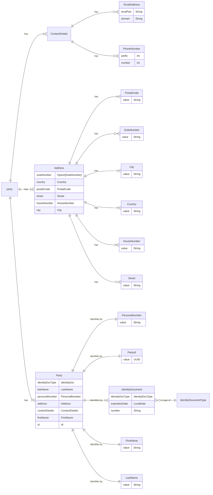

```mermaid
erDiagram
direction LR
ContactDetails
party ||--|{ ContactDetails : "has" 
EmailAddress {
  localPart String
  domain String
}
ContactDetails ||--o{ EmailAddress : "has" 
PhoneNumber {
  prefix Int
  number Int
}
ContactDetails ||--o{ PhoneNumber : "has" 
PostalCode {
  value String
}
Address ||--|{ PostalCode : "has" 
SuiteNumber {
  value String
}
Address ||--o{ SuiteNumber : "has" 
City {
  value String
}
Address ||--|{ City : "has" 
Country {
  value String
}
Address ||--|{ Country : "has" 
HouseNumber {
  value String
}
Address ||--|{ HouseNumber : "has" 
Street {
  value String
}
Address ||--o{ Street : "has" 
Address {
  suiteNumber Option[SuiteNumber]
  country Country
  postalCode PostalCode
  street Street
  houseNumber HouseNumber
  city City
}
party ||--|{ Address : "has" 
Party {
  identityDocType IdentityDoc
  lastName LastName
  personalNumber PersonalNumber
  address Address
  contactDetails ContactDetails
  firstName FirstName
  id Id
}
party ||--|{ Party : "has" 
PersonalNumber {
  value String
}
Party ||--|| PersonalNumber : "identifies by" 
PartyId {
  value UUID
}
Party ||--|| PartyId : "identifies by" 
IdentityDocument {
  identityDocType IdentityDocType
  expirationDate LocalDate
  number String
}
Party ||--|{ IdentityDocument : "identifies by" 
FirstName {
  value String
}
Party ||--|| FirstName : "identifies by" 
IdentityDocument
IdentityDocumentType
IdentityDocument }o--|| IdentityDocumentType : "is type of" 
LastName {
  value String
}
Party ||--|| LastName : "identifies by" 
```
