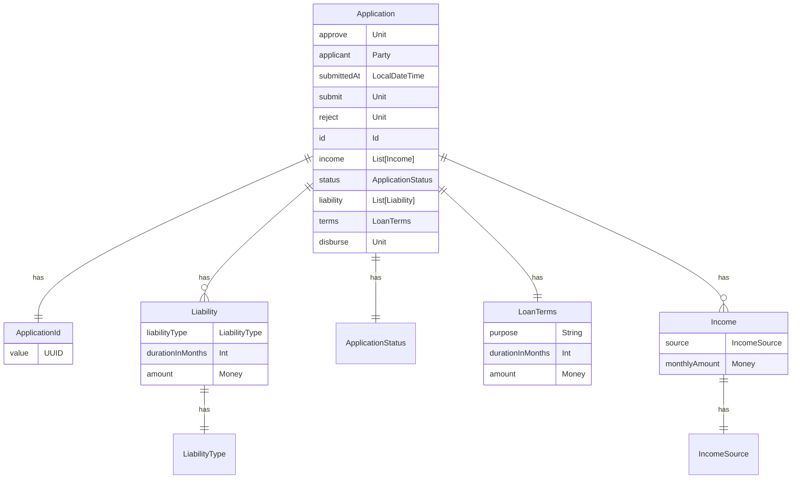

```mermaid
erDiagram
LiabilityType
Application {
 approve Unit
 applicant Party
 submittedAt LocalDateTime
 submit Unit
 reject Unit
 id Id
 income List[Income]
 status ApplicationStatus
 liability List[Liability]
 terms LoanTerms
 disburse Unit
}
Application ||--|| ApplicationId : has
Application ||--o{ Liability : has
Application ||--|| ApplicationStatus : has
Application ||--|| LoanTerms : has
Application ||--o{ Income : has
IncomeSource
Liability {
 liabilityType LiabilityType
 durationInMonths Int
 amount Money
}
Liability ||--|| LiabilityType : has
Income {
 source IncomeSource
 monthlyAmount Money
}
Income ||--|| IncomeSource : has
ApplicationStatus
ApplicationId {
 value UUID
}
LoanTerms {
 purpose String
 durationInMonths Int
 amount Money
}
```
